README.md

# Employee Churn Analysis 
The purpose of this project is to use SQL to analyze employee attrition rates and flag any employees who fit the pattern of those who have previously left. 

## Overview
- Which job roles/departments have the highest and lowest exit rates?
- Does workload and monthly income contribute to attrition? 
- How long into their tenure do employees typically leave?
- Can we flag potential employees who may leave next?

## Key Findings
- Sales Representatives are the highest flight risk at 39.8% attrition, followed by Laboratory Technicians (23.9%) and HR (23.1%). By department, Sales leads attrition while Research & Development has the lowest exit rate.
- Employees working overtime leave at a higher rate than those who don't. Employees earning under $3K/month have the highest attrition, and within most job roles, leavers earned less than stayers on average. Low job satisfaction (rating of 1) doubles exit risk compared to high satisfaction (22.8% vs 11.3%).
- Employees with less than 2 years at the company leave at a rate of 34.9% while those with 10+ years leave at a rate of 10.4%. This along with the age data show that employees under the age of 25 have 39.2% attrition, dropping to around 10% for the 35-44 age band.  This indicates early-career employees are likely still exploring options.
- Based on the patterns identified, we can build a 'high-risk profile': employees earning under $4,000/month, working overtime, with job satisfaction rated 2 or below. This query identified current employees matching these criteria.
- Other notable patterns
- - Employees living 20+ km away leave at a rate of 22.1% versus 13.8% for those within 5 km.
- - Male employees show slightly higher attrition (17.0%) than female (14.8%).


## Analysis

### 1. Data Validation
	a)  How complete is the data? I am looking for nulls in the columns we will be using most. 
``` 
SELECT
    COUNTIF(Age IS NULL) AS null_age,
    COUNTIF(Attrition IS NULL) AS null_attrition,
    COUNTIF(Department IS NULL) AS null_department,
    COUNTIF(MonthlyIncome IS NULL) AS null_income,
    COUNTIF(JobRole IS NULL) AS null_jobrole,
    COUNTIF(YearsAtCompany IS NULL) AS null_years
FROM ibm-hr-project.HR_analytics.employees
```


	b) Checking for validity of useful data. I am counting the amount of unique employee records and the amount of unique values in each column
```
SELECT 
    COUNT(*) as total_employees,
    COUNT(DISTINCT Age) AS age,
    COUNT(DISTINCT Department) AS department,
    COUNT(DISTINCT JobRole) AS jobrole,
    COUNT(DISTINCT JobLevel) AS joblevel,
    COUNT(DISTINCT MonthlyIncome) AS income
FROM ibm-hr-project.HR_analytics.employees
```
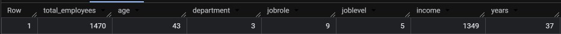

	c) Calculating the number of people who left and who stayed and the attrition rate 
```
SELECT 
    COUNT(*) AS total_employees,
    COUNTIF(Attrition = TRUE) AS leavers,
    COUNTIF(Attrition = FALSE) AS stayers,
    ROUND(COUNTIF(Attrition = TRUE) / COUNT(*) * 100, 2) AS attrition_rate_pct
FROM ibm-hr-project.HR_analytics.employees
```
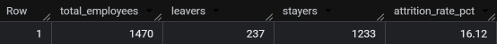

### 2. Which roles and departments have the highest exit rates?
a) Job Role

```
SELECT 
    JobRole,
    COUNT(*) AS total_employees,
    COUNTIF(Attrition = TRUE) AS leavers,
    ROUND(COUNTIF(Attrition = TRUE) / COUNT(*) * 100, 2) AS attrition_rate_pct
FROM ibm-hr-project.HR_analytics.employees
GROUP BY JobRole
ORDER BY attrition_rate_pct DESC
```
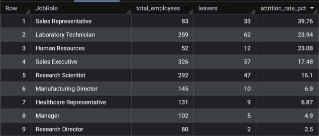

b) Department
```
SELECT 
    Department,
    COUNT(*) AS total_employees,
    COUNTIF(Attrition = TRUE) AS leavers,
    ROUND(COUNTIF(Attrition = TRUE) / COUNT(*) * 100, 2) AS attrition_rate_pct
FROM ibm-hr-project.HR_analytics.employees
GROUP BY Department
ORDER BY attrition_rate_pct DESC
```


### 3. Does monthly income and workload affect attrition?
	a) Calculating average incomes by job roles leavers vs stayers

```
SELECT 
    JobRole,
    ROUND(AVG(CASE WHEN Attrition = TRUE THEN MonthlyIncome END), 0) AS avg_leavers,
    ROUND(AVG(CASE WHEN Attrition = FALSE THEN MonthlyIncome END), 0) AS avg_stayers,
    ROUND(AVG(CASE WHEN Attrition = FALSE THEN MonthlyIncome END) - 
          AVG(CASE WHEN Attrition = TRUE THEN MonthlyIncome END), 0) AS income_gap
FROM ibm-hr-project.HR_analytics.employees
GROUP BY JobRole
ORDER BY income_gap DESC
```

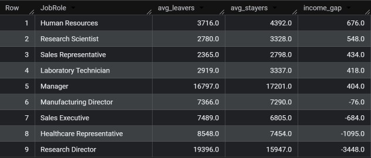

	b) Organizing income into bins and calculating the attrition rate by pay band

```
SELECT 
    CASE 
        WHEN MonthlyIncome < 3000 THEN '1. Under 3K'
        WHEN MonthlyIncome < 5000 THEN '2. 3K-5K'
        WHEN MonthlyIncome < 8000 THEN '3. 5K-8K'
        WHEN MonthlyIncome < 12000 THEN '4. 8K-12K'
        ELSE '5. 12K+'
    END AS income_band,
    COUNT(*) AS total_employees,
    COUNTIF(Attrition = TRUE) AS leavers,
    ROUND(COUNTIF(Attrition = TRUE) / COUNT(*) * 100, 2) AS attrition_rate_pct
FROM ibm-hr-project.HR_analytics.employees
GROUP BY income_band
ORDER BY income_band
```
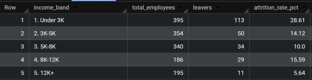

	c) Seeing if overtime affects exit rates

```
SELECT 
    OverTime,
    COUNT(*) AS total_employees,
    COUNTIF(Attrition = TRUE) AS leavers,
    ROUND(COUNTIF(Attrition = TRUE) / COUNT(*) * 100, 2) AS attrition_rate_pct
FROM ibm-hr-project.HR_analytics.employees
GROUP BY OverTime
```

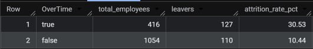

### 4. How long until employees start leaving?
	a) Creating duration bins
```
SELECT 
  CASE 
    WHEN YearsAtCompany < 2 THEN '0-1 years'
    WHEN YearsAtCompany < 5 THEN '2-4 years'
    WHEN YearsAtCompany < 10 THEN '5-9 years'
    ELSE '10+ years'
  END AS tenure_band,
  COUNT(*) AS total_employees,
  COUNTIF(Attrition = TRUE) AS leavers,
  ROUND(COUNTIF(Attrition = TRUE) / COUNT(*) * 100, 2) AS attrition_rate_pct
FROM ibm-hr-project.HR_analytics.employees
GROUP BY tenure_band
ORDER BY tenure_band
```
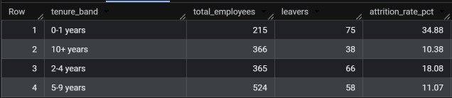

### 5. Who might leave next?
	a) Creating a 'High Risk Profile'. The highest rate of leavers have had a monthly income under $4000, worked overtime, and had a job satisfaction of 2 or under

```
SELECT 
    'High Risk Profile' AS flagged,
    COUNT(*) AS total_employees,
    COUNTIF(Attrition = TRUE) AS leavers,
    ROUND(COUNTIF(Attrition = TRUE) / COUNT(*) * 100, 2) AS attrition_rate_pct
FROM ibm-hr-project.HR_analytics.employees
WHERE MonthlyIncome < 4000
    AND OverTime = TRUE
    AND JobSatisfaction <= 2
```
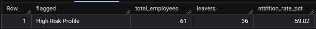

	b) Applying the 'High Risk Profile' flags to current employees

```
SELECT 
    EmployeeNumber,
    JobRole,
    Department,
    MonthlyIncome,
    JobSatisfaction
FROM ibm-hr-project.HR_analytics.employees
WHERE Attrition = FALSE  
    AND MonthlyIncome < 4000
    AND OverTime = TRUE
    AND JobSatisfaction <= 2
```

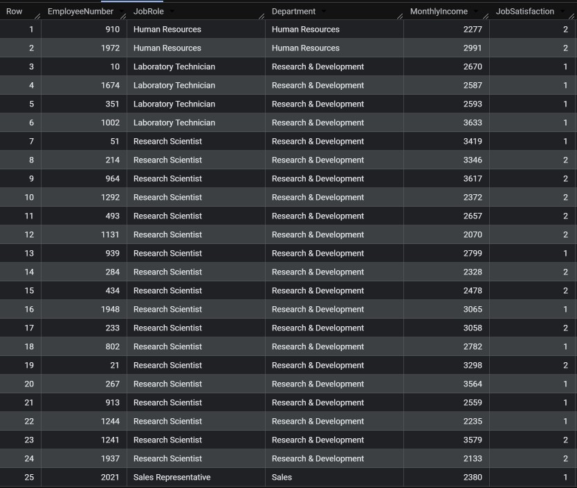


## Demographics
1) Age
```
SELECT 
    CASE 
        WHEN Age < 25 THEN 'Under 25'
        WHEN Age < 35 THEN '25-34'
        WHEN Age < 45 THEN '35-44'
        WHEN Age < 55 THEN '45-54'
        ELSE '55+'
    END AS age_band,
    COUNT(*) AS total_employees,
    COUNTIF(Attrition = TRUE) AS leavers,
    ROUND(COUNTIF(Attrition = TRUE) / COUNT(*) * 100, 2) AS attrition_rate_pct
FROM ibm-hr-project.HR_analytics.employees
GROUP BY age_band
ORDER BY age_band
```
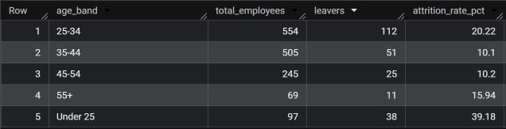

2) Gender

```
SELECT 
    Gender,
    JobLevel,
    COUNT(*) AS total_employees,
    COUNTIF(Attrition = TRUE) AS leavers,
    ROUND(COUNTIF(Attrition = TRUE) / COUNT(*) * 100, 2) AS attrition_rate_pct,
    ROUND(AVG(MonthlyIncome), 0) AS avg_income
FROM ibm-hr-project.HR_analytics.employees
GROUP BY Gender, JobLevel
ORDER BY JobLevel, Gender
```

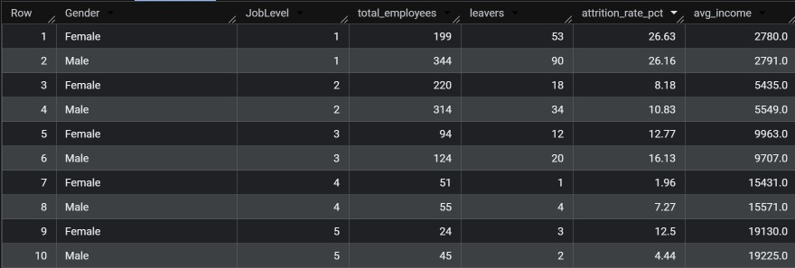

3) Job Satisfaction 

1 = 'Low'
2 = 'Medium'
3 = 'High'
4 = 'Very High'

```
SELECT 
    JobSatisfaction,
    COUNT(*) AS total_employees,
    COUNTIF(Attrition = TRUE) AS leavers,
    ROUND(COUNTIF(Attrition = TRUE) / COUNT(*) * 100, 2) AS attrition_rate_pct
FROM ibm-hr-project.HR_analytics.employees
GROUP BY JobSatisfaction
ORDER BY JobSatisfaction
```

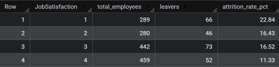

4) Distance from home
```
SELECT 
    CASE 
        WHEN DistanceFromHome <= 5 THEN '1. 0-5 km'
        WHEN DistanceFromHome <= 10 THEN '2. 6-10 km'
        WHEN DistanceFromHome <= 20 THEN '3. 11-20 km'
        ELSE '4. 20+ km'
    END AS distance_band,
    COUNT(*) AS total_employees,
    COUNTIF(Attrition = TRUE) AS leavers,
    ROUND(COUNTIF(Attrition = TRUE) / COUNT(*) * 100, 2) AS attrition_rate_pct
FROM ibm-hr-project.HR_analytics.employees
GROUP BY distance_band
ORDER BY distance_band
```


## Tools Used
BigQuery, Claude, Google, Kaggle, GitHub
